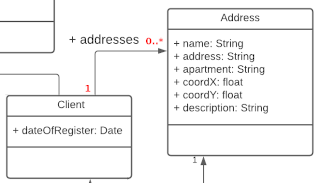
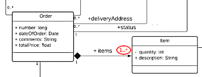
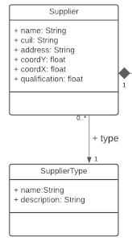

# Trabajo Práctico Final

**DISEÑO DE BASES DE DATOS - MG IS 2021**

###INFORME TRABAJO PRÁCTICO FINAL###

MAYO 2022

####*Docentes:*

Mg. Javier Bazzocco

Lic.Federico Di Claudio

####*Alumnos:*

Blas Cenzano Dragún

Martin Cesar Urbieta

{Grupo 8}

### PARTE 1 - JPA

En esta primera parte, se ha implementado la solución JPA, junto con el desarrollo del código del modelo, el cual fue sujeto a análisis por parte del grupo.
En la segunda parte, se tratará la implementación en DBMongo.

####Análisis de Diagrama de clases
En el diagrama faltaba la cardinalidad entre las clases Client y Address, como se explica en el enunciado.
La relación Client

A criterio del grupo, se entiende que la **relación Order-Item** debe ser de **1 a 1-***, en lugar de 0-* como se propone, para **evitar tener órdenes vacías sin items.**

A criterio del grupo, la **relación Producto-Supplier** debe ser de **0..* a 1**, en lugar de **0..* a 0..*** como se propone en el diseño UML, ajustándolo al enunciado del problema que indica: “…Cada producto es exclusivo de un proveedor…”, verificándose una relación de muchos a 1 y no como la diseñada originalmente. Cada producto es administrado por un sólo proveedor.

La **relación Supplier-SupplierType** debe ser de **0..* a 1**, en lugar de 0..* a 0..* como se propone en el diseño UML, el enunciado del problema indica: “…, cada proveedor posee un tipo (SupplierType)…”, siendo una relación de muchos a 1 ya que cada proveedor es solo de un tipo (restaurant, heladería, quiosco, etc).

####Desarrollo del modelo.

Considerando que la propuesta de aplicación del TP FINAL responde a una variante del API REST delivery trabajado como ejercicio adicional en clase[^1], se evaluó en primera instancia, analizar y seleccionar el código apto para REFACTORING e implementación en el trabajo final.
Se destaca que la clase **DeliveryRoot** fue eliminada, y fueron agregadas al modelo las siguientes clases:

Address: que tomó atributos de coordX y coordY que formaban parte de Order.
-Item
-Qualification
-Product
-HistoricalProductPrice
-ProductType
-Supplier
-SupplierType

A su vez, se procedió a realizar un REFACTORING	 del Controller.

En los casos que un método o atributo del API REST trabajado en clase no figure en el modelo, se mantendrá implementado, salvo que contradiga las especificaciones del TP FINAL.

Se ha generado diagrama ERD (Entity–relationship model), como complemento del diagrama UML.

Para definición de nombres de las tablas, se ha optado por utilizar la notación underscore o snake_case en lugar de otras como PascalCase o camelCase, para distinguir  SQL keywords usados en query, principalmente en este último caso. En el modelo se ha optado por la notación camelCase.

En primer lugar, entendemos que se califica la orden, y esta aplica directamente en el supplier, y no se califica cada ítem en particular recibido siendo una única calificación integral. También, entendemos que la orden sólo incluye items de un mismo proveedor/supplier, es decir, el deliveryman no puede tomar dos o más pedidos de distintos suppliers para una misma orden.

Se ha optado por una leve modificación del modelo, con el fin de lograr una solución más fácil y performante, en relación al comportamiento Order - Qualification (e indirectamente Supplier). Atento a la relación 1 a 1 entre Order y Qualification, para SQL se ha optado por no crear una tabla de Qualification, y embeberla en Order, al igual que SUPPLIER (name), ya que Qualification relaciona Order-Supplier de manera 1 a 1. Esto, con el objetivo de minimizar las operaciones de join requeridas para calcular el Score del Supplier.

Si bien se ha procurado mantener la mayor eficiencia del modelo, se ha permitido del desarrollo de algunos endpoints bajo la premisa *Make It Work* susceptible a eventual refactoring en la Parte 2 (DBMONGO).

En relación al STATE, se ha optado por una instanciación de la Clase, en lugar de la propuesta CASE presentada en delivery_bd[^1]. Se consideró que al rechazar por parte del Delivery Man, el estado de orden o pedido del cliente, vuelva a pending volviendose a confirmar la orden para asignar un nuevo repartidor, debido a que mantiene su voluntad de consumir el producto, pero es el delivery man quien no puede ejecutar el envío.

####DASE DE DATOS

La base de datos de producción se encuentra disponible en

[tpfinal_bd.sql.zip](https://github.com/fedediclaudio/tpfinal_bd/files/8690088/tpfinal_bd.sql.zip)

y los curl post

[curlpost+jsons.zip](https://github.com/fedediclaudio/tpfinal_bd/files/8690097/curlpost%2Bjsons.zip)

####Mapeos
Al establecer los mapeos en JPA, se mantuvo en primer lugar la recomendación de la cursada respecto a la estrategia de recuperación  estableciendo en primer lugar un FetchType.LAZY, y evaluar posteriormente la necesidad de cambiar a FetchType.EAGER, en función de los resultados esperados en las consultas. De las trece (13) definiciones de FetchType, 4 se mantuvieron en LAZY y 9 debieron pasarse a EAGER.

En el caso particular de la clase Order, se debió establecer para Ítems el modo en que se seleccionan los datos, estableciendo @Fetch(value = FetchMode.SUBSELECT).

Las operaciones en cascada, por lo general se resolvieron con CascateType.MERGE,  es decir,  las entidades relacionadas se unirán al contexto de persistencia cuando la entidad propietaria se una. Se mantuvo este criterio en base a la API REST de ejemplo utilizada en clase.

En dos ocasiones se resolvió con CascateType.ALL, donde se aplican todos los tipos de cascada.

####Persistencia

En relación a los patrones usualmente requeridos en persistencia, se optó por la utilización de Repositorio, que desde la perspectiva del cliente/usuario, debe verse o comportarse como una colección. Significa que debe admitir operaciones como agregar, eliminar, contener, etc.

Para mantener simplicidad, no se implementó DTOs que operen con el repositorio.

Los repositorios se implementaron extendiendo la interfaz CrudRepository que proporciona toda la funcionalidad CRUD. Éstos se diseñaron de forma que las consultas se resuelvan todas por el motor de la base de datos, para ello éstas se implementaron con Métodos de Consultas Derivadas o Custom Queries.

La elección de esto fue la de priorizar la performance de la aplicación, ya que el esfuerzo de la recuperación de la información lo hace el motor de la base de datos de forma eficiente, en el caso de hacerlo desde la aplicación se debía realizar consultas que luego había que procesar, recuperando más información de la necesaria y que luego había que filtrar con esfuerzo de cómputo. En una aplicación de pocos registros es indistinto, pero cuando esa información crece cada vez es menos performante, incurriendo en más tiempo o más necesidad de hardware para mantener la calidad del servicio en tiempos tolerables.

La implementación de los Métodos de Consultas Derivadas nos permitió no tener que reformular cuando se cambiara la base de datos ya que la conformación de la consulta lo hace el framework, siendo esta la mejor resolución. En los casos que se utilizaba las Custom Queries, se debe reformular la consulta cuando se cambiaba la base de datos, que si bien conlleva tener que tocar la aplicación, esa modificación era fácilmente trazable, siendo la tarea tan sencilla como buscar donde estaba la anotación @Query/@Aggregation (según el caso) y reemplazandolo con la consulta correspondiente al motor que se va a utilizar, teniendo luego una aplicación que en su performance no iba a ser reducida.
Como para tener una idea del impacto de actualización en el cambio de la base de datos, de 25 consultas sólo 5 se tuvieron que actualizar, que en cantidad y en porcentaje es poco en relación de la búsqueda de performance.

[^1]: https://github.com/fedediclaudio/delivery_bd notificado por Ideas el 22/10/21

### PARTE 2 - MONGOJPA

En esta segunda parte, se ha implementado la solución Mongo.
Se utilizó Robot 3T para operar las collecciones y Postman para evaluar los endpoints.
La plataforma IDE utilizada fue IntelliJ IDEA Community Edition.

####Mapeos

En mongo, las relaciones fueron resueltas con @DBRef, que son resueltas como EAGER en forma predeterminada, aunque no se especificó lo contrario ( @DBRef(lazy=false) ), ya que el objeto mapeado que se ve igual que si hubiera estado almacenado incrustado (embedded) en nuestro documento maestro.

En relación a implementar embedded al insertar una relación como documento estático, se prefirió mantener un comportamiento similar a la solución JPA. Un conocimiento más profundo de los alcances de la API REST favorecen establecer la conveniencia o no de embedded los documentos o no.

####Adaptaciones realizadas

Sobre la base del modelo JPA, se realizaron los siguientes cambios, aparte de las configuraciones en _POM_:
- Adecucaión de annotations:
  - **@Document** en reemplazo de **@Entity** / **@Embeddable**
  - **@Field** en reemplazo de **@Columns** , **@Embedded** y los casos Eager
  - **@DBRef** en lugar de las variantes **@OneToMany**, **@ManyToOne** ,**@ManyToMany** para los casos Lazy
  - **@@MongoId** , **@JsonSerialize** y **ObjectID** en lugar de la notación JPA **@Id**
- Adecuación de modelo, repositorios y servicios:
  - El cambio de ID de Long a **ObjectID**, implica los ajustes respectivos a los getters, repositorios y servicios.

####Setup Docker

- Se procedió a la instalación de docker en Ubuntu según lo indicado en el siguiente enlace

`https://www.digitalocean.com/community/tutorials/how-to-install-and-use-docker-on-ubuntu-20-04-es`

- El siguiente comando permite correr docker sin estar loggeado

`sudo chmod 666 /var/run/docker.sock`

- Montado y ejecución de imagen Mongo, persistiendo en carpeta local las colecciones. El comando debe ejecutarse estando en la carpeta *./tpfinal_bd_Mongo/data* que es la que se persistirá. 
`docker run --name mongo-container -v $(pwd):/data/db -p 27017:27017 -d mongo:latest`

- Para poder realizar commits de las colecciones, se debió desproteger la carpeta:
`sudo chmod 777 -R /home/martinurbieta/develp/BaseDatos2021/tpfinal_bd_Mongo/data`

- Otros comandos útiles para docker:
 
    **Listado de imagenes**
    `docker images`
 
    **Estados**
    `docker ps`

    **Detener imagen**
    `docker stop mongo-container`

    **Remover imagen**
    `docker rm -f IdImagen`
    
    **Inspección**
    `docker inspect mongo`
    `sudo systemctl start mongod`
    
    **Browse imagen**
    `docker exec -it mongo-container bash`

####Generacion de colecciones via Curl + docker php+apache
En la carpeta donde se encuentran los archivos *curlpost_host.docker.internal.php* y *tpfinaldata.json*
se corre el siguiente comando de docker, donde se levanta un servidor PHP y se corre el curlpost que se encuentra en la carpeta local.
El docker se vincula al localhost de la machine con el flag *--add-host=host.docker.internal:host-gateway*[^2] y en el archivo PHP el endpoint corespondiente es *http://host.docker.internal:8081/api/*

`docker run --name="apache_server" --rm --add-host=host.docker.internal:host-gateway -v $(pwd):/app/ php:7.4-apache php /app/curlpost_host.docker.internal.php /app/tpfinaldata.json
`

El siguiente comando permite identificar el IP de la maquina para poder comunicar el docker con el local host
`ip addr show docker0 | grep -Po 'inet \K[\d.]+'
`Para el caso particular, correspondió el *IP 172.17.0.1* y en el archivo PHP correspondía cambiar el endpoint a *'http://172.17.0.1:8081/api/'*

Ingresando al docker via
`docker exec -it apache_server bash`
se puede verificar el host
`cat /etc/hosts`

[^2]:  https://www.howtogeek.com/devops/how-to-connect-to-localhost-within-a-docker-container/#:~:text=You%20just%20need%20to%20reference,0.1%20.&text=Your%20host's%20Docker%20IP%20will,services%20running%20on%20your%20host.

###Verificación de las implementaciones de endpoints en la aplicación

Un cambio importante, ha sido el manejo del ObjectID, que para compatibilizarlo con el browser, debía ser transformado a string o bien ser levantado en el modelo como DBRef new ObjectID.

Las intervenciones han sido principalmente en los queries de repositorios específicos de SQL, que han sido adaptados a NOSQL, interviniéndose en 5 de 15 requisitos, sin considerar cambios propios de ObjectID o comentar código. Los queries de MongoDB eran probados previamente en Robo 3T y luego implementados en el sistema, requiriendose ajustes de sintaxis con el uso de comillas.

Nos encontramos con situaciones en que el mismo query ejecutado en MongoDB emitía una salida que satisfacía el requisito. Sin embargo, se optó por intervenir de forma tal de minimizar los cambios en el código, de forma tal que pueda volverse de Mongo a JPA con la menor cantidad de modificaciones o refactoring. Este critero puede no ser el más performante al no aprovechar en mayor medida las consultas de MongoDB, pero permitiría asegurar una hipotetica continuidad en el pipeline de la aplicación, sin realizar parsings adicionales. Sin embargo, existe una salvedad indicada y justificada.

##### Requisitos de sistema - Intervenciones al pasar de JPA a MongoDB
1 Agregar un ítem a una orden ya creada (=)
Endpoint: `http://localhost:8081/api/order/{number}/addItem`
No se debió intervenir, salvo la gestión del ID long por ObjectID.

----------------
2 Confirmar un pedido. Esto implica buscar un repartidor libre y asignarle dicho pedido.
Endpoint: `http://localhost:8081/api/order/{number}/confirm`
Se intervino la implementación del servicio y el repositorio, unificando dos SQL queries en un sólo query de MongoDB
`countByFreeTrueAndActiveTrue` + `findByFreeTrueAndActiveTrue` -> `findRandomlyByFreeTrueAndActiveTrue`
---------------------------------
3 Añadir una calificación a una orden ya completada. Tenga en cuenta que deberá actualizar la calificación del proveedor.
Endpoint: `http://localhost:8081/api/order/{number}/qualify`
No se debió intervenir, salvo la gestión del ID long por ObjectID.

Test Qualify
1) Estado: Orden Confirmada:
   `http://localhost:8081/api/order/62a3847a0b361a202e8957cc/confirm`
2) Estado: Orden Entregada:
   `http://localhost:8081/api/order/62a3847a0b361a202e8957cc/deliver`
3) Calificar orden completada:
   `http://localhost:8081/api/order/62a3847a0b361a202e8957cc/qualify
   `

Body califiacación.

`{
"score": 10,
"commentary": "alles goede"
}`

-----------------------------
4 Actualizar los datos de un producto. Tenga en cuenta que puede cambiar su precio.
Endpoint: `http://localhost:8081/api/product/{id}`
No se debió intervenir, salvo la gestión del ID long por ObjectID.
------------------------------------
5 Eliminar un producto de los ofrecidos por un proveedor.
Endpoint: `http://localhost:8081/api/product/{id}`
Test case: `http://localhost:8081/api/product/62a3847a0b361a202e89576e`
No se debió intervenir, salvo la gestión del ID long por ObjectID.
Borra de colección el producto, pero mantiene las referencias en items, lo cual es consistente a mi entender para mantener registro del item (producto) vendido.

--------------------------------------
6 Obtener todos los proveedores de un cierto tipo.
Endpoint: `http://localhost:8081/api/supplier/byTpe/{id}`
Test case: `http://localhost:8081/api/supplier/byTpe/62a384790b361a202e8956ba`
No se debió intervenir, salvo la gestión del ID long por ObjectID.
--------------------------------------
7 Obtener todos los productos y su tipo, de un proveedor específico.
endpoint: `http://localhost:8081/api/product/bySupplier/{id}`
test case:  `http://localhost:8081/api/product/bySupplier/62a384790b361a202e89572c`
No se debió intervenir, salvo la gestión del ID long por ObjectID.
-------------------

8 - Obtener las órdenes con más productos de un proveedor específico.
endpoint: `http://localhost:8081/api/order/maxItems/supplier/{supplier}`
Se intervino el query SQL en OrderRepository para migrarlo a MongoDB. En el servicio respectivo, se intervino implementando DBRef.

-------------------

9 - Obtener la orden de mayor precio total de un día dado.
Endpoint: `http://localhost:8081/api/order/maxTotalPrice/inDate/{date}`
test case: `http://localhost:8081/api/order/maxTotalPrice/inDate/2022-06-10`
Sin intervenir solución JPA para Mongo.

----------------------

10 - Obtener los diez repartidores con mayor puntaje.
Endpoint and test: `http://localhost:8081/api/deliveryMan/bestTen`
Nota: sin intervenir solución JPA para Mongo.
-----------------------

11 - Obtener los diez proveedores que más ordenes despacharon.
endopoint and test: `http://localhost:8081/api/supplier/bestTenDispatchers`
Se intervino el query SQL en SupplierRepository, optimizando su salida con MongoDB para evitar el parsing del `paging` implementado en JPA.

----------------

12 - Obtener los precios de un producto entre dos fechas dadas.
endpoint: `http://localhost:8081/api//product/{id}/historicalPrice/betweenDates/{startDateStr}/{finishDateStr}` Not crashing.
testcase: `http://localhost:8081/api/product/62a3847a0b361a202e895784/historicalPrice/betweenDates/2021-06-08/2023-06-11`
Analizando el requisito, se modificó el servicio para atender fechas nulas, extrapolando el cambio retroactivo a JPA, y por lo tanto, ambas soluciones son compatibles.
-----------------
13 - Obtener el precio promedio de los productos de cada tipo, para todos los tipos.
Enpoint and test : `http://localhost:8081/api/product/averagePrices/for/allTypes` 
Se debió adecuar el query del repositorio en ProductRepository. Se mantuvo el código en la implementaciń del servicio.

-------------------
14 Obtener la información de los proveedores que tengan al menos una calificación de una estrella (la más baja). Es necesario también el número de estas calificaciones que el proveedor posee.

endpoint: `http://localhost:8081/api/supplier/qualification/hasAtLeast/{stars}`
testcase: `http://localhost:8081/api/supplier/qualification/hasAtLeast/8`
Nota: se modificó el servicio, atento a que la solución JPA resultaba, si bien operativa, no satisfactoria a nuestro entender, aún contemplando que no se evalúa performance en este trabajo.
------------------------

15 - Obtener los proveedores que ofrezcan productos de todos los tipos.
endpoint:  `http://localhost:8081/api/supplier/allProductTypes`

En la implementaión del servicio, debió comentarse parte del código del método getAllSuppliers() donde se inicializaba lazy en JPA con .size
`
    @Override
    @Transactional(readOnly = true)
    public List<Supplier> getAllSuppliers() {
        List<Supplier> suppliers = this.supplierRepository.findAll();
//        for (Supplier supplier : suppliers) {
//            supplier.getProducts().size();
//        }
return suppliers;
}`

Con dicho cambio, el endpoint utilizado funcionó correctamente.
endpoint y test: `http://localhost:8081/api/supplier/allProductTypes`
Nota: el resultado con la colección actual [], atento a que ningún proveedor cumple con dicho requisito, sin embargo.

#### Reflexiones
El framework sin duda facilita el paso de una base de datos SQL a otra NOSQL como ser MongoDB, con conocimientos básicos, minimizando la intervención del código lo menos posible, atento a que uno de los integrantes del grupo no contaba con experiencia en Java, SQL o Mongo.
La gestión de repositorios resulta amigable. Las mayores intervenciones se enfocaron en la migracioń de los queries espedificos de SQL a MongoDB, resultando intuitivo donde enfocar los ajustes.
Una parte importante de la dedicación del TP fue establecer la dinámica para poblar la base de datos mediante cURL, donde el cambio de *ID* de *Long* a *ObjectID* requirió adaptarlo de SQL a MongoDB. 
